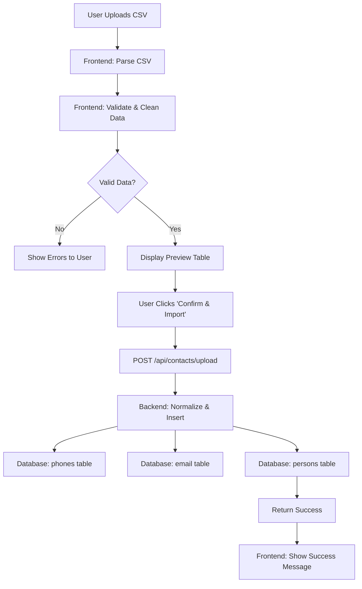
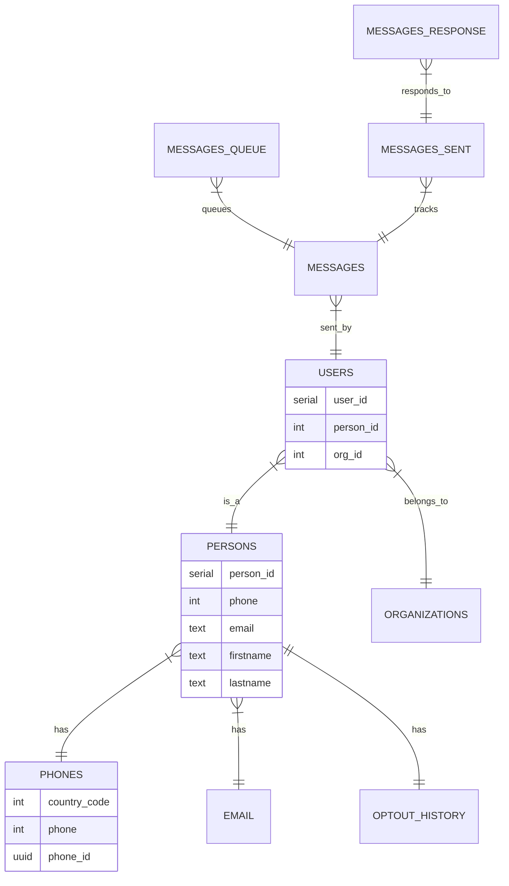

# SlideSMS Database Architecture & Data Flow

## Overview

This document explains the database schema, data flow from CSV upload to storage, and what data moves between frontend and backend.

## Data Flow Diagram



## What Happens at Each Step

### 1. Frontend Processing (No Database Yet)
**Location**: `app/upload/page.tsx` + `utils/csvHelpers.ts`

**Input**: CSV file from user
**Processing**:
- Parse CSV using `papaparse`
- Infer which columns are Name, Phone, Email
- Clean phone numbers (remove +1, parentheses, dashes)
- Validate (10 digits for US)
- Remove duplicates
- Separate valid vs invalid rows

**Output**: 
```typescript
{
  valid: [
    { name: "John Doe", phone: "5551234567", email: "john@example.com" },
    { name: "Jane Smith", phone: "5559876543", email: "jane@example.com" }
  ],
  invalid: [...],
  duplicates: 1,
  total: 7
}
```

**Stored**: Only in browser memory (React state) - **NOT in database yet**

### 2. User Confirmation
User sees the preview table and clicks "Confirm & Import"

### 3. API Call
**Endpoint**: `POST /api/contacts/upload`
**Payload**:
```json
{
  "contacts": [
    { 
      "firstname": "John", 
      "lastname": "Doe", 
      "phone": "5551234567", 
      "country_code": 1, 
      "email": "john@example.com" 
    }
  ]
}
```

### 4. Backend Processing
**Location**: `app/api/contacts/upload/route.ts` (to be created)

**Processing**:
- Receive validated contacts list
- For each contact:
  1. **Insert/Get Phone**: Insert into `phones` (on conflict do nothing), retrieve `phone_id` (generated hash).
  2. **Insert/Get Email**: Insert into `email` (on conflict do nothing).
  3. **Insert Person**: Insert into `persons` linking the `phone` and `email`.
  4. **(Future)**: Link Person to User/Organization (requires relationship table).

### 5. Database Storage
**Tables**: `phones`, `email`, `persons`
**Inserted Data Logic**:
```sql
-- 1. Insert Phone (phone_id is auto-generated)
INSERT INTO phones (country_code, phone) VALUES (1, 5551234567) 
ON CONFLICT (country_code, phone) DO NOTHING;

-- 2. Insert Email
INSERT INTO email (email) VALUES ('john@example.com')
ON CONFLICT (email) DO NOTHING;

-- 3. Insert Person
INSERT INTO persons (phone, email, firstname, lastname)
VALUES (5551234567, 'john@example.com', 'John', 'Doe');
```

### 6. Response to Frontend
**Success Response**:
```json
{
  "success": true,
  "inserted": 2
}
```

## Database Schema (MVP)

### Core Tables

```sql
CREATE TABLE phones (
    country_code INT NOT NULL DEFAULT 1,
    phone INTEGER NOT NULL,
    -- Deterministic hash of country_code and phone (UUID)
    phone_id UUID NOT NULL GENERATED ALWAYS AS (
        md5((country_code::text || ':' || phone::text))::uuid
    ) STORED,
    loaded_datetimeutc TIMESTAMPTZ NOT NULL DEFAULT NOW(),
    loaded_source TEXT NOT NULL,
    loaded_by TEXT NULL,
    UNIQUE (country_code, phone)
);

CREATE TABLE email (
    email TEXT NOT NULL,
    loaded_datetimeutc TIMESTAMPTZ NOT NULL DEFAULT NOW(),
    loaded_source TEXT NOT NULL,
    loaded_by TEXT NULL,
    PRIMARY KEY (email)
);

CREATE TABLE organizations (
    org_id SERIAL PRIMARY KEY,
    loaded_datetimeutc TIMESTAMPTZ NOT NULL DEFAULT NOW(),
    loaded_source TEXT NOT NULL,
    loaded_by TEXT NULL
);

CREATE TABLE persons (
    person_id SERIAL PRIMARY KEY,
    phone INTEGER,
    email TEXT,
    firstname TEXT,
    lastname TEXT,
    loaded_datetimeutc TIMESTAMPTZ NOT NULL DEFAULT NOW(),
    loaded_source TEXT NOT NULL,
    loaded_by TEXT NULL,
    FOREIGN KEY (phone) REFERENCES phones(phone), -- Note: FK to phone number, not ID, based on schema provided
    FOREIGN KEY (email) REFERENCES email(email)
);

CREATE TABLE users (
    user_id SERIAL PRIMARY KEY,
    person_id INT NOT NULL,
    org_id INT NOT NULL,
    loaded_datetimeutc TIMESTAMPTZ NOT NULL DEFAULT NOW(),
    loaded_source TEXT NOT NULL,
    loaded_by TEXT NULL,
    FOREIGN KEY (person_id) REFERENCES persons(person_id),
    FOREIGN KEY (org_id) REFERENCES organizations(org_id)
);

CREATE TABLE optout_history (
    person_id INT NOT NULL,
    opt_out BOOLEAN NOT NULL,
    loaded_datetimeutc TIMESTAMPTZ NOT NULL DEFAULT NOW(),
    loaded_source TEXT NOT NULL,
    loaded_by TEXT NULL,
    PRIMARY KEY (person_id),
    FOREIGN KEY (person_id) REFERENCES persons(person_id)
);

CREATE TABLE messages (
    message_id SERIAL PRIMARY KEY,
    user_id INT NOT NULL,
    message_raw TEXT,
    message_final TEXT,
    loaded_datetimeutc TIMESTAMPTZ NOT NULL DEFAULT NOW(),
    loaded_source TEXT NOT NULL,
    loaded_by TEXT NULL,
    FOREIGN KEY (user_id) REFERENCES users(user_id)
);

CREATE TABLE messages_queue (
    queue_id SERIAL PRIMARY KEY,
    message_id INT NOT NULL,
    phone INTEGER NOT NULL,
    scheduled_at_local TIMESTAMP,
    scheduled_at_utc TIMESTAMP,
    loaded_datetimeutc TIMESTAMPTZ NOT NULL DEFAULT NOW(),
    loaded_source TEXT NOT NULL,
    loaded_by TEXT NULL,
    FOREIGN KEY (message_id) REFERENCES messages(message_id)
);

CREATE TABLE messages_sent (
    sent_id SERIAL PRIMARY KEY,
    message_id INT NOT NULL,
    loaded_datetimeutc TIMESTAMPTZ NOT NULL DEFAULT NOW(),
    loaded_source TEXT NOT NULL,
    loaded_by TEXT NULL,
    FOREIGN KEY (message_id) REFERENCES messages(message_id)
);

CREATE TABLE messages_response (
    received_id SERIAL PRIMARY KEY,
    sent_id INT NOT NULL,
    received_type TEXT,
    error_message TEXT,
    loaded_datetimeutc TIMESTAMPTZ NOT NULL DEFAULT NOW(),
    loaded_source TEXT NOT NULL,
    loaded_by TEXT NULL,
    FOREIGN KEY (sent_id) REFERENCES messages_sent(sent_id)
);

CREATE TABLE phones_score_history (
    phone INTEGER NOT NULL,
    score NUMERIC,
    model_version TEXT,
    loaded_datetimeutc TIMESTAMPTZ NOT NULL DEFAULT NOW(),
    loaded_source TEXT NOT NULL,
    loaded_by TEXT NULL,
    PRIMARY KEY (phone)
);
```

### Schema Diagram



## What Goes to Database vs What Stays in Frontend

### ✅ Stored in Database
- **Phones**: Unique phone numbers (normalized)
- **Emails**: Unique email addresses
- **Persons**: Identity records linking names to phones/emails
- **Users**: System accounts linked to Persons and Organizations
- **Messages**: Content and metadata

### ❌ NOT Stored in Database
- **Raw CSV file**: Discarded after parsing
- **Invalid rows**: Only shown to user, not saved
- **Duplicate entries**: Handled by database constraints (ON CONFLICT)

## Database Design Decisions

**1. Normalized Identity (`persons`, `phones`, `email`)**
- ✅ Reduces duplication (same phone number stored once)
- ✅ Allows multiple people to share a phone/email (if needed) or strict uniqueness
- ✅ Centralizes contact info for scoring/opt-outs

**2. `phone_id` Hash**
- ✅ Provides a deterministic UUID for every phone number
- ✅ Useful for anonymized scoring or external integrations
- ✅ Generated automatically by the database

**3. Audit Columns (`loaded_datetimeutc`, `source`, `by`)**
- ✅ Tracks exactly when and how data entered the system
- ✅ Critical for debugging data issues

## Questions to Consider

1. **User-Contact Relationship**: The current schema creates global `persons`. To implement "My Contacts", we may need a linking table (e.g., `user_contacts` or `lists`) to associate specific `persons` with the `user_id` who uploaded them.
2. **Phone/Email Ownership**: Currently `persons` links to `phones` and `email`. If multiple users upload "John Doe", do we create multiple `persons` or reuse one?
