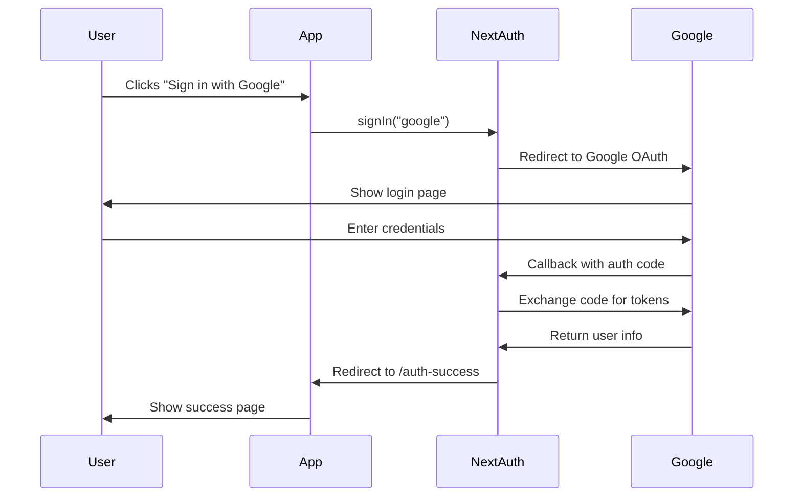

# OAuth Authentication Setup - Testing Guide

I've implemented the **real Google OAuth flow** using NextAuth.js. Here's what changed and how to test it:

## What I Implemented

### 1. NextAuth API Route
Created [`src/app/api/auth/[...nextauth]/route.ts`](file:///c:/vsWorkspace/SlideSMS/slidesms/src/app/api/auth/[...nextauth]/route.ts)
- Configured Google OAuth provider
- Set up callbacks to redirect to `/auth-success` after login
- Reads credentials from your `.env.local` file

### 2. Updated Home Page
Modified [`src/app/page.tsx`](file:///c:/vsWorkspace/SlideSMS/slidesms/src/app/page.tsx)
- Replaced the static "Simulate Login Success" link with a real **"Sign in with Google"** button
- Uses NextAuth's `signIn()` function to trigger the OAuth flow

### 3. Session Provider
Updated [`src/app/layout.tsx`](file:///c:/vsWorkspace/SlideSMS/slidesms/src/app/layout.tsx)
- Wrapped the app with `SessionProvider` to manage authentication state

---

## How to Test the OAuth Flow

### Prerequisites
Make sure you have completed these steps in Google Cloud Console:

1. **Create OAuth Client ID**
   - Go to [Google Cloud Console](https://console.cloud.google.com/)
   - Navigate to **APIs & Services > Credentials**
   - Create an **OAuth 2.0 Client ID**

2. **Configure Authorized URLs**
   - **Authorized JavaScript origins**: `http://localhost:3000`
   - **Authorized redirect URIs**: `http://localhost:3000/api/auth/callback/google`

3. **Add Credentials to `.env.local`**
   - Copy your **Client ID** and **Client Secret**
   - Paste them into `c:\vsWorkspace\SlideSMS\slidesms\.env.local`
   - Generate a random string for `NEXTAUTH_SECRET` (or run `openssl rand -base64 32`)

### Testing Steps

1. **Make sure the dev server is running**
   ```bash
   npm run dev
   ```

2. **Open your browser to** `http://localhost:3000`

3. **Click "Sign in with Google"**
   - You'll be redirected to Google's login page
   - Sign in with your Gmail account (use your test email)
   - Google will ask for permission to share your profile info

4. **After approving**, you'll be redirected back to:
   - `http://localhost:3000/auth-success`
   - You should see the success message with the animated background

### What Happens Behind the Scenes



---

## Troubleshooting

### Error: "Redirect URI mismatch"
- **Cause**: The redirect URI in Google Cloud Console doesn't match
- **Fix**: Make sure you added `http://localhost:3000/api/auth/callback/google` exactly

### Error: "Invalid client"
- **Cause**: Wrong Client ID or Secret in `.env.local`
- **Fix**: Double-check you copied them correctly from Google Cloud Console

### Button doesn't work / No redirect
- **Cause**: `.env.local` not loaded or server not restarted
- **Fix**: Restart the dev server (`Ctrl+C` then `npm run dev`)

---

## Next Steps

Once you confirm the OAuth flow works:
- We can add a **user dashboard** page
- Store user sessions in a database
- Add **sign out** functionality
- Protect routes that require authentication

Ready to test? Click that button and let me know what happens! 🚀
